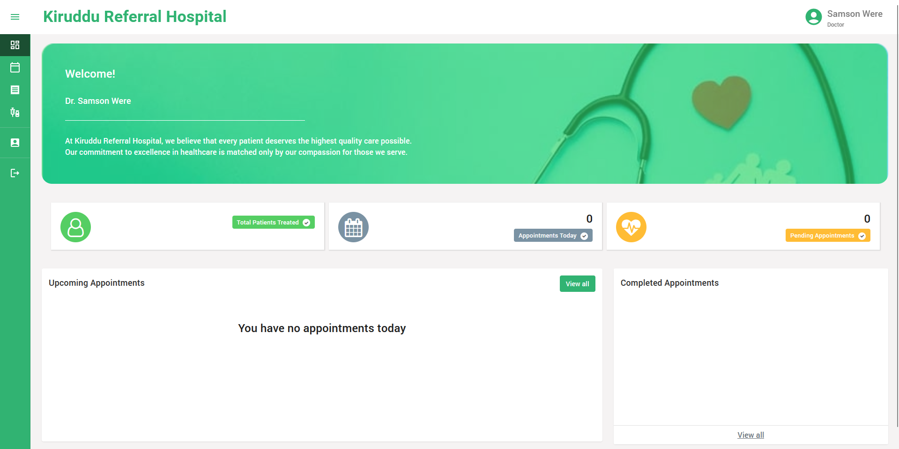

# Kiruddu Referral Hospital Management System

This is a Hospital Management System built using the MERN Stack (MongoDB, Express, React, Node.js). It is a web-based application for Kiruddu Referral Hospital that allows hospital staff to digitalize hospital operations and manage patient records, appointments, and billing information.

## Features

- User authentication and authorization
- User management (Add, Update, Delete)
- Patient management (Add, Update, Delete)
- Doctor management (Add, Update, Delete)
- Appointment scheduling
- Billing and payment management
- Dashboard with key performance indicators (KPIs) and analytics

## Getting Started

To get started with the project, follow these steps:

1. Clone the repository:

   ```bash

   git clone https://github.com/Samsonroyal/Kiruddu-Hospital-MS.git

   ```

   Or, if you downloaded the zipped folder, extract it to your desired location.
   and then open the project with your desired IDE(Integrated Development Environment); I prefer to use VsCode.

2. Open two terminals concurrently.

3. In the first terminal, navigate to the `server` folder:

   ```bash

   cd server

   ```

   Then install the dependencies:

   ```bash

   npm install

   ```

   Make sure to populate the `.env` file with the necessary values required for the server to run.

4. In the second terminal, navigate to the `client` folder:

   ```bash

   cd client

   ```

   Then install the dependencies:

   ```bash

   npm install

   ```

5. Again, make sure to populate the `.env` file in the `client` folder with the necessary values required for the client to run.

6. After installing the dependencies in both terminals, start the server and client:

   In the `server` terminal:

   ```bash

   npm start

   ```

   In the `client` terminal:

   ```bash

   npm start

   ```

   This will start the server and client concurrently.

7. Once the server and client are running, you can access the application at http://localhost:3000 in your web browser.

## Deployment

The project is deployed on Vercel. When deploying the project, ensure that the necessary environment variables are configured in the Vercel dashboard.

Link to Deployment: https://kiruddu-hospital-ms.vercel.app/


## Screenshots
A brief sneakshot of the Doctor Dashboard
